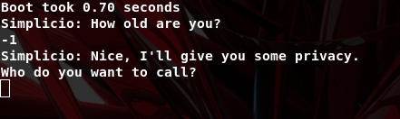

## Some notes
 - I did NOT solve this challenge during the event, because of some logistic problems, in fact, i have already seen the solution from the following writeup:
   * [https://ctftime.org/writeup/18660](https://ctftime.org/writeup/18660)
 - The purpose of this writeup is to add some background to kernel exploitation that is missing from the original writeup and that i want to share otherwise is just for me

## Prereq
 - skip this part if you think you should
 - Kernel exploitation is like heap exploitation, wrong, but in the end you just need to corrupt some data structure.
   In fact, the general solution, to simplify ctf kernel pwn, is some sort of module that we must interact with:
   - interact with his ioctl functions (e.g. open, close,..) and find vuln
   - trigger the vuln to execute arbitrary code in kernel mode
   - modify some structure so after we ret we are root
 - the PCB in Linux is represented by the task_struct structure:
```
// [include/linux/sched.h]

struct task_struct {
    volatile long state;            // process state (running, stopped, ...)
    void *stack;                    // task's stack pointer
    int prio;                       // process priority
    struct mm_struct *mm;           // memory address space
    struct files_struct *files;     // open file information
    const struct cred *cred;        // credentials associated to the process
  // ...
};
```
 - that is all we need ( [More concepts here](https://blog.lexfo.fr/cve-2017-11176-linux-kernel-exploitation-part1.html#Core-Concepts) )


## What and How
 - [file given for the challenge](simp.tar.gz)
 - [CTF linux kernel pwn basics](https://mem2019.github.io/jekyll/update/2019/01/11/Linux-Kernel-Pwn-Basics.html)
 - [Extract kallsyms](https://github.com/marin-m/vmlinux-to-elf)


## Vulnerability
 - Stack overflow + null-dereference. Nothing more and nothing less. We will trigger these vuln in the following order:
   1. the first one is for escaping the sandbox (the Simplicio's Jail)
   2. the second one is for the privilege escalation from userland to root


## Escape the sandbox
 - pwnable file resume: amd64, statically linked, no canary, no pie, no full relro
 - the bad of statically linked is that we cannot play with the entire libc, but we can directly call syscall, because for sure will be at least the read, write syscall
 - reversing pwnable:



```
int __fastcall phonecall(int age) {
  char buff1; // points to (rbp-120h)
  char buff2; // points to (rbp-100h)

  if ( age < 0 )                               // [0]
  {
    puts("Simplicio: Nice, I'll give you some privacy.");
    puts("Who do you want to call?");
    gets(&buff1);                               // [1.a]
    puts("Please enter a message:");
    gets(&buff2);                               // [1.b]
  }
  else
  {
    // ... cut ...
  }
  return printf("Sending your message to %s\n", &buff1);
}
```
 - to meet the condition [0], the age must be negative
 - in [1.a,b] we have bof that we can trigger to do some rop and escape the sandbox
 - note the buff1 starts from the address (rbp - 0x120), the buff2 starts from (rbp-0x100), in the second case we must overwrite 256 byte + 8 byte old rbp
 - python Ropper.py  --file pwnable --nocolor > [rop_pwnable.txt](./rop_pwnable.txt)
 - now the path to follow can be:
   - (a) spawn a shell and then import some shellcode that interacts with '/dev/simplicio'
   - (b) do all in rop // solution taken in the original writeup


## Privilege Escalation 
 - reversing the module:
```
__int64 __fastcall simplicio_ioctl(file *file, unsigned int cmd, req * args)
{
  req * tmp_args;
  __int64 (__fastcall *file_op_now)(req *); // rbx@1

  tmp_args = args;
  file_op_now = share_feet_pics;
  printk(&msg_begin);
  if ( cmd != 0x100 )                       // [0]
  {
    file_op_now = view_feet_pics;
    if ( cmd != 0x200 )                     // [1]
      file_op_now = 0LL;
  }
  printk(&msg_end);
  return file_op_now(tmp_args);             // [2]
}
```
 - in [2] we may possibly run into a null-dereference, if we pass an argument, 'cmd', that meets [0] and [1] conditions.
   Now immagine we reached [2], and so we have kernel panic if we not map 0 address, we can map it from userspace and then jump inot it because there's no smep protection
 - ./kallsyms-finder bzImage > [kallsyms_output.txt](./kallsyms_output.txt)
 - read this good slide [https://tc.gtisc.gatech.edu/bss/2014/r/kernel-exploits.pdf](https://tc.gtisc.gatech.edu/bss/2014/r/kernel-exploits.pdf)
 - So a common approach to getting a root shell from an exploit which grants execution in the kernel is to jump to a user controlled function 
   which does the following: ```	commit_creds(prepare_kernel_cred(NULL)); ```
 - If we try here we get kernel panic.. in fact the final solution they did was to launch commit_creds(init_cred)


## Exploit
 1. bof from userland
 2. init stage
    * call mprotect and make x+w some memory region so after we can put our shellcode and then jump into it
    * fill the memory region with the shellcode
    * jump into the shellcode
 3. shellcode stage
    * mmap the memory region 0x0
    * fill the memory region 0x0 with the code that will be executed next by the kernel, that will call commit_creds function
    * open '/dev/simplicio'
    * call ioctl(fd, cmd, req), with cmd !=0x100 and !=0x200, and req points to init_cred symbol
    * after we return we should be root, so pop a shell 

 - [original exploit here](https://ctftime.org/writeup/18660)

