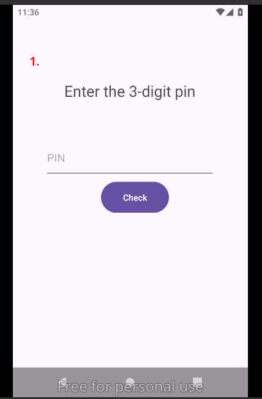
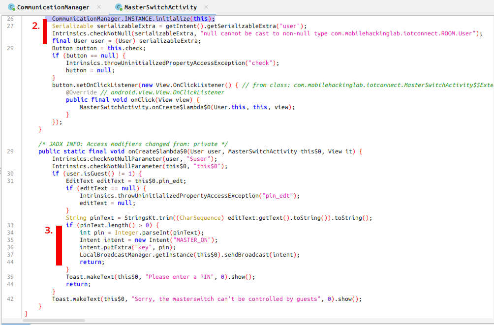
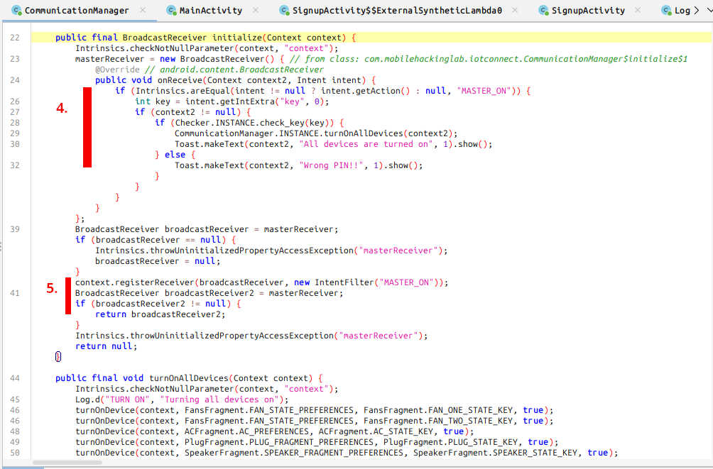
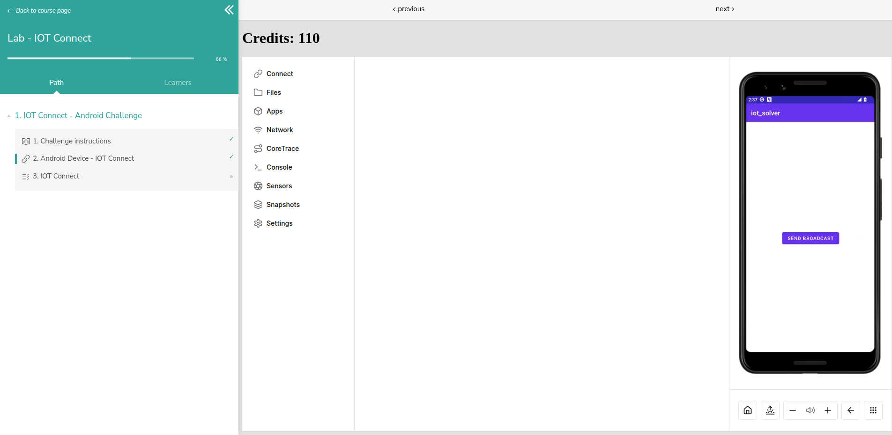
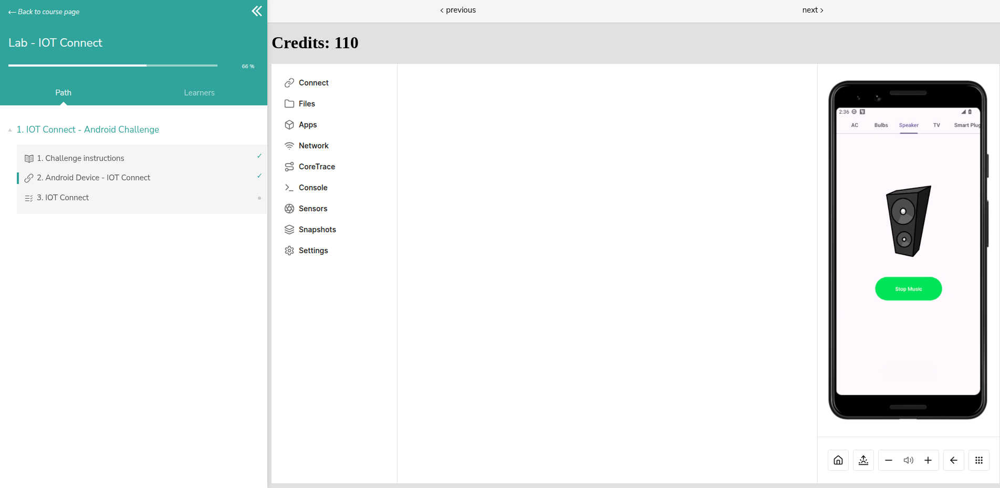

## description 

The app declares the activities: `<activity android:exported="false" android:name="com.mobilehackinglab.iotconnect.CommunicationManager"/>` and `<activity android:exported="false" android:name="com.mobilehackinglab.iotconnect.MasterSwitchActivity"/>`. 

The `MasterSwitchActivity` is used when the user inserts a PIN to activate all IoT devices (1). 

After logging in, the `MasterSwitchActivity` is created. It then initializes (2) the `CommunicationManager`, which registers (4, 5) a `BroadcastReceiver` object for the intent "MASTER_ON". This receiver is dynamically declared, meaning it will only be created if the app is running.







<br/>

The receiver is now also declared in the manifest file as follows. This should make the service reachable by other APKs even when the app is not running. However, for some reason, it is not functioning as expected.

```
        <receiver android:enabled="true" android:exported="true" android:name="com.mobilehackinglab.iotconnect.MasterReceiver">
            <intent-filter>
                <action android:name="MASTER_ON"/>
            </intent-filter>
        </receiver>
```

<br/>

## solution

One possible solution is to spawn the app and then create another app to brute-force the PIN by sending broadcast messages.

1. Using android studio, create an empty project

2. Copy [activity_main.xml](./activity_main.xml) into `app/src/main/res/layout/`, copy [MainActivity.java](.MainActivity.java) into `app/src/main/java/com/example/<your-namespace>/`

3. Append the following lines to your manifest file

```
        <activity
            android:name=".MainActivity"
            android:exported="true">
            <intent-filter>
                <action android:name="android.intent.action.MAIN" />
                <category android:name="android.intent.category.LAUNCHER" />
            </intent-filter>
        </activity>

```

4. build the apk: `./gradlew assembleDebug --stacktrace --info`






